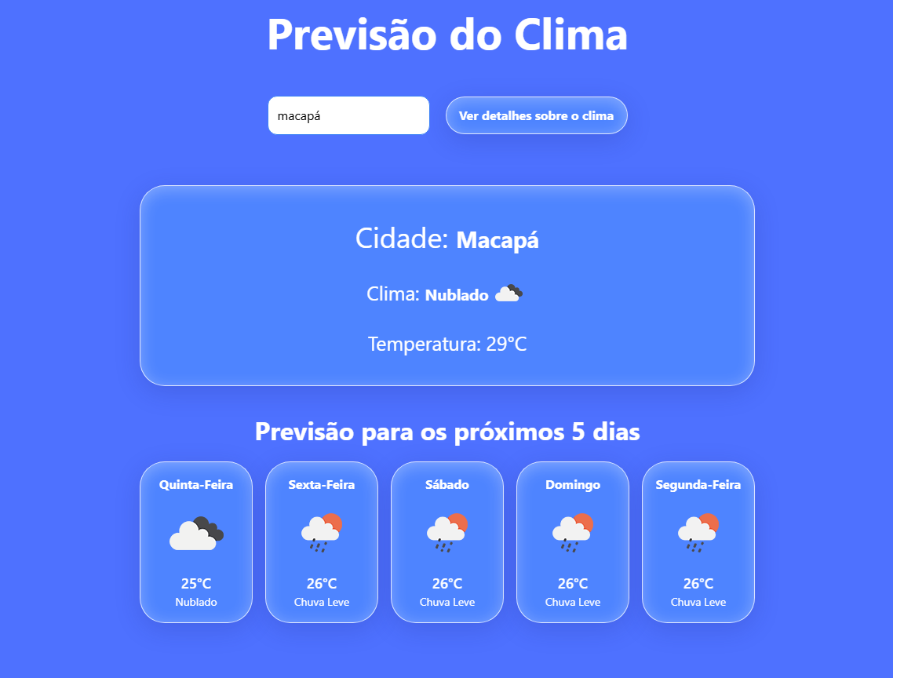

# 🌦️ Clima App - Previsão do Tempo


<p align="center">
  Uma aplicação web moderna para consulta de previsão do tempo em tempo real, construída com tecnologias de ponta do ecossistema REACT.
</p>

<p align="center">
  
</p>

## ✨ Funcionalidades

- **Busca por Cidade**: Pesquise o clima de qualquer cidade do mundo.
- **Clima Atual**: Veja informações detalhadas como temperatura, sensação térmica, umidade e velocidade do vento.
- **Previsão para 5 Dias**: Visualize a previsão do tempo para os próximos 5 dias, com intervalos de 3 horas.
- **Design Responsivo**: Interface adaptável para uma ótima experiência tanto em desktops quanto em dispositivos móveis.
- **Notificações Inteligentes**: Avisos na tela para erros, como cidades não encontradas.
- **Interface Dinâmica**: Elementos que se movem e se ajustam após a busca para uma melhor visualização dos dados.
- **Validação de Dados**: Mostra uma mensagem de erro caso a cidade seja invalida ou fique vazia.

## 🔧 Tecnologias Utilizadas

Este projeto foi construído utilizando as seguintes tecnologias:

- **Front-end:**
  - [**React**](https://reactjs.org/) - Biblioteca para construção de interfaces de usuário.
  - [**Vite**](https://vitejs.dev/) - Ferramenta de build moderna e ultrarrápida.
  - [**Tailwind CSS**](https://tailwindcss.com/) - Framework CSS utility-first para estilização rápida.
- **Comunicação com API:**
  - [**Axios**](https://axios-http.com/) - Cliente HTTP baseado em Promises.
- **API Externa:**
  - [**OpenWeatherMap API**](https://openweathermap.org/api) - Fornecimento de dados de clima.

## ⚙️ Instalação e Execução

Siga os passos abaixo para rodar o projeto em seu ambiente local.

**1. Clone o repositório:**
```bash
git clone https://github.com/PedrooLukas/Previs-o-do-Clima
```

**2. Navegue até a pasta do projeto:**
```bash
cd Previs-o-do-Clima
```

**3. Instale as dependências:**
```bash
npm install
```

**4. Configure as Variáveis de Ambiente:**

   É necessário ter uma chave de API da OpenWeatherMap para que o projeto funcione.

   - Crie um arquivo chamado `.env` na raiz do projeto.
   - Adicione a seguinte linha a ele, substituindo `SUA_CHAVE_API_AQUI` pela sua chave:

   ```
   VITE_OPENWEATHER_KEY=SUA_CHAVE_API_AQUI
   ```
   - Você pode obter uma chave gratuita no site da [OpenWeatherMap](https://home.openweathermap.org/users/sign_up).

**5. Rode o projeto:**
```bash
npm run dev
```
A aplicação estará disponível em `http://localhost:5173` (ou outra porta indicada no terminal).

## 📄 Licença

Este projeto está sob a licença MIT. Veja o arquivo [LICENSE](LICENSE.md) para mais detalhes.

---

Feito por Pedro Lukas.
